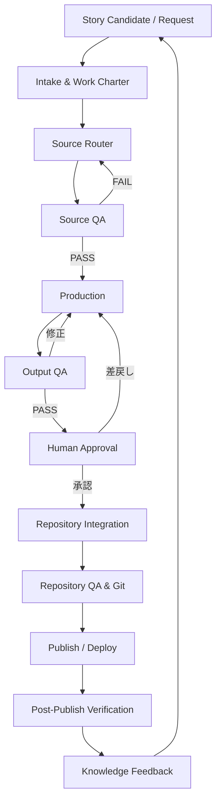

# AI Production Pipeline v1.21

**Document type:** Standard Operating Procedure（SOP）<br>
**Status:** Current / Operational v1.21<br>
**Owner:** 稲田美来<br>
**Scope:** Story Candidate、教材、note、SNS、運営文書、Brand／Education／AI Organization関連Source、その他AI制作物<br>
**Purpose:** 既存OS・Sourceを毎回確実に選択・実読・適用し、成果物と新知見を正しい責任単位へ戻すためのAI組織共通運用<br>

---

## 0. このSOPが解決する問題

SourceがRepositoryに存在することと、制作時に利用されたことは同義ではない。

Voice OS未参照事件では、Voice OSが存在していたにもかかわらず、制作前に必読Source、現行Version、実読証跡を保証する工程がなかった。その結果、渡されたSourceの範囲でOutput QAを通せても、入力段階で欠けていた「みくらしさ」を保証できなかった。

本SOPは、Output QAの前に **Source Router** と **Source QA** を置き、次を標準化する。

1. 案件種別から必要なSourceを選ぶ。
2. 現行正本・Version・依存関係・実読を確認する。
3. Source QAがPASSするまで制作を開始しない。
4. Productionは承認済みSourceを成果物へ変換し、未定義事項を独断で補完しない。
5. Output QAと人間承認を通過したものだけを正式領域へ昇格させる。
6. 制作中に得た知見を自動でOSへ書き込まず、更新候補として責任Sourceへ戻す。

> **本SOPは新しいOSではない。既存OSを毎回運用するための実行規約である。**

---

## 1. 基本原則

### 1.1 Source存在とSource利用を分ける

「Repositoryにある」「AIが名前を知っている」「過去に読んだ」は参照証跡にならない。

参照済みと認めるには、案件単位の `Source Manifest` に、現行正本、VersionまたはGit commit、読了、適用箇所が記録されていなければならない。

Production AIは、既知のcanonical pathを直接開いたことだけでCurrent Sourceを解決済みと判定しない。Source Routerは責任root／正式entry sourceからCurrent候補、canonical指定、Canonical Delta、README／INDEX／参照ガイドおよび依存Sourceを探索し、選択と除外を記録する。過去Taskの読了、要約、memoryまたは既存Manifestを今回Taskの実読証跡として再利用しない。

### 1.2 必須参照を満たした後に最小化する

すべての案件で全Sourceを無制限に読むことは標準としない。

正しい順序は、次のとおりとする。

1. 案件種別と責任本籍から必読Sourceを確定する。
2. 必読Sourceを漏れなく実読する。
3. その後、責任と関係しないSourceを参照対象から外す。

### 1.3 責任本籍を越えない

| Source／工程 | 担う責任 | 担わない責任 |
|---|---|---|
| Human OS | みくの判断原則、価値判断、保留条件 | Voice・文体・Repository仕様の再定義 |
| Voice OS | 話し方、言葉選び、思考・感情の表出 | note固有の構成、ブランド戦略 |
| Writing Style OS | 公開文章の文体、構成、リズム | 事業判断、教育内容、正確性の代替 |
| Brand OS | 事業の理念、世界観、表現・体験・品質の上位原則 | 専門領域の具体手順の代替 |
| Education Core／Course OS | 教育倫理、教育設計、Course固有判断 | 人格・ブランド・Repository規則の改変 |
| AI Organization | AIの役割、権限、責任分離、受け渡し | 個別成果物の内容判断そのもの |
| Repository Rules | 正本、配置、Version、Archive、CHANGELOG、Gitの運用 | 内容の教育的・ブランド的妥当性判断 |
| Production | 承認済みInputを成果物へ変換 | 上位Sourceの創設・改変、欠落の推測補完 |
| QA | Input充足とOutput妥当性の検証 | 新しい価値判断の代行 |

### 1.4 人間承認とRepository保存を分ける

Repositoryは承認を生み出す場所ではなく、承認済み正本・版・履歴を保持する場所である。

ファイルがRepository内に置かれたこと、正式らしいファイル名であること、Git管理されていることだけでは承認済みと判定しない。

### 1.5 Feedbackは候補として戻す

制作中の発見は、即時にHuman OS、Voice OS、Writing Style OS、Brand OS等へ書き込まない。

Evidence、AI推論、改善案、単発の好みを分け、責任Sourceの更新候補としてHuman Reviewへ渡す。

### 1.6 未採用Sourceを代替しない

案件種別別Source Profileが媒体別SOPその他の責任Sourceを必読として要求し、現行Repositoryにcanonical Sourceがない場合、その案件はG1またはG2で**HUMAN DECISION REQUIRED**とする。

AIは、似た文書、過去の会話、個人の記憶またはBrand／Voice Sourceによって未採用Sourceを代替しない。これは当該案件の制作可否を保留するControlであり、欠けたSourceの新設・採用を自動的に決定するものではない。

### 1.7 Immediate Execution Rule

人間をAI間・工程間の実行中継へ戻さない原則と、実行予告を同一応答・工程内の実行へ接続する条件は、`03_Human_in_the_Loop/HUMAN_IN_THE_LOOP.md` §5.1を正とする。

PipelineのPhase移行、次Actionの説明または実行予定の表明は停止点ではない。現在のAIが承認済み範囲内で実行可能な後続作業は、予告だけで終了せず、その応答・工程内で実行する。

---

## 2. 全体Pipeline



### 2.1 標準Gate一覧

| Gate | 判定 | PASS条件 | FAIL時の戻り先 |
|---|---|---|---|
| G0 Intake Gate | 依頼定義 | 目的・成果物・対象・公開範囲・承認者が確定 | Intake & Work Charter |
| G1 Routing Gate | Source選択 | 案件種別・責任本籍・必読Source・任意Sourceが確定 | Source Router／Human Decision |
| G2 Source QA Gate | Input品質 | 現行正本・Version・実読・漏れ・依存・矛盾が解決 | Source Router／Source管理責任者 |
| G3 Production Completeness Gate | 制作完了 | 指示された成果物一式と参照証跡が揃い、実行を表明した作業が実施済み | Production |
| G4 Output QA Gate | 成果物品質 | 内容・Source整合・形式・安全・媒体要件を満たす | Production |
| G5 Human Approval Evidence Gate | 成果物最終判断 | 人間責任者のFinal Approval Evidenceが、必須Inputと実file SHAを検証済みのimmutable Package identity、公開先、目的へbindingされ、実行対象と一致する。noteでは新しい承認を求めず自動検証する | Production／Output QA／Human Final Review |
| G6 Repository Integration Gate | 正式配置 | 保存先・波及更新・Version・INDEX・CHANGELOGが整う | Repository Integration |
| G7 Git Gate | 正式反映 | diff・テスト・追跡対象・commit範囲が妥当 | Repository Integration |
| G8 Publish Gate | 公開実行 | 公開版がG5検証済みPackageと一致し、媒体別Approval Evidenceとチャネル要件を満たす | Publish／G5／Human Decision |
| G9 Verification Gate | 公開確認 | URL・表示・リンク・画像・公開範囲・日時を確認 | Publish／緊急訂正 |
| G10 Feedback Gate | 知見回収 | 発見が分類・重複判定・責任先へRouting済み | Knowledge Feedback |

### 2.2 Response／Phase Completion Check

AIは応答または工程を終了する前に、次を自己確認する。

> この応答・工程で「やる／作る／出す／直す」と宣言した作業を、実際に完了したか？

NOの場合、現在のAIに実行可能なら終了せず該当作業を実行する。Human Decision、Tool、権限または接続の不足により実行不能なら、理由と人間にしかできない最小操作を明示し、未完了として扱う。

---

## 3. 役割と実行環境

| 役割 | 主責任 | 標準環境 |
|---|---|---|
| Human Owner／Approver | 目的、価値判断、Source矛盾、正式採用、公開の最終承認 | Chat／Work |
| Story Curator | Story Candidateの抽出、重複整理、優先度候補 | Chat／Work |
| Source Router | 案件種別から責任Sourceを選択 | Work／Codex |
| Source Auditor | 現行版・実読・依存・漏れ・矛盾を監査 | Work／Codex |
| Production AI | 承認済みInputから成果物を制作 | Work |
| Internal QA | Source反映、内容、形式、成果物間整合を監査 | Work |
| External Reviewer | 内部組織と異なる視点で高リスク成果物を監査 | Claude等、必要時のみ |
| Repository Integrator | 正式保存先、波及更新、INDEX、CHANGELOG、Versionを処理 | Codex |
| Git Operator | diff、status、test、commit、push | Codex |
| Publisher | note、SNS、Web等へ承認版を展開 | 対象媒体 |
| Feedback Curator | Evidenceと改善候補を分類し、責任Sourceへ戻す | Chat／Work／Codex |

同一AIが複数役割を連続して担当することはできる。ただし、工程の境界と判定記録は分ける。Production AIが「自分で作ったからPASS」と自己認定してはならない。

---

## 4. Phase 0 — Story Candidate / Request Intake

### 4.1 目的

壁打ち、事件、違和感、失敗、発見、依頼を、制作可能な案件単位へ変換する。

### 4.2 責任

- Storyとして残す価値があるかを候補化する。
- 制作依頼と単なるメモを分ける。
- 緊急修正、通常制作、Source変更を区別する。

### 4.3 Input

- 会話ログ、Story Candidate、制作依頼
- 制作中のIncident、公開後の反応
- 既存Backlog、事業上の優先順位

### 4.4 Output

`Work Charter`：

- Task ID
- 案件名
- 目的
- 成果物種別
- 対象読者／利用者
- 公開範囲
- 成功条件
- リスク区分
- 最終承認者
- 希望期限
- 関連Story Candidate ID

### 4.5 必読Source

- 案件受付・Story管理に関する現行Source
- AI Organization関連Source
- 依頼に明示されたSource

### 4.6 Gate

**PASS:** 目的、成果物、対象、公開範囲、最終承認者が一意に説明できる。<br>
**FAIL:** 不足項目だけを人間へ確認し、Intakeへ戻る。制作は開始しない。

---

## 5. Phase 1 — Source Router

### 5.1 目的

今回の成果物に必要なSourceを、案件種別・責任本籍・リスクから選択する。

### 5.2 責任

- 必読Sourceと任意参照Sourceを分ける。
- Sourceの選択理由を示す。
- Brand OSの入口から必要な責任ファイルへRoutingする。
- 教育、文体、Repository、公開媒体等の専門Sourceを接続する。

### 5.3 Input

- G0通過済みWork Charter
- Source Index／Repository Index
- 責任root／正式entry sourceと、その配下のCurrent候補
- `AI_ORGANIZATION.md`
- Repository Rules
- 既存の案件種別別Source Profile

### 5.4 Output

`Source Plan`：

| 項目 | 記録内容 |
|---|---|
| Source名 | canonical filenameまたは責任単位名 |
| 責任本籍 | Human／Voice／Writing／Brand／Education／Production／Repository等 |
| Required | 必読／条件付き必読／任意 |
| 選択理由 | 成果物のどの判断に必要か |
| 依存先 | 先に読むSource、関連する下位Source |
| 適用範囲 | 構成、言葉、教育内容、Visual、保存、公開等 |
| 除外理由 | 関係しそうだが今回は読まないSourceの理由 |

Source Planは固定pathの列挙から開始しない。責任本籍ごとに責任root／正式entry sourceを先に確定し、次を探索して`Resolved Source Set`を作る。

1. Currentを名乗るSource候補とStatus／Version。
2. canonical filenameまたは複数Source構成を指定するRepository Rules、README、INDEX、参照ガイド。
3. Canonical Delta、差分正本、version付き並列Current、Draft、Deprecated、Archive。
4. 選択したcanonical Sourceが明示する依存Sourceと、案件の適用範囲上必要な専門Source。

候補は、選択したものだけでなく除外したものもpathと理由を記録する。責任root内に未列挙のCurrent候補が残る場合、またはCurrent Canonical Delta／差分正本がcanonical Sourceと並立する場合、G1はPASSしない。正式に採用された差分はRepository Integrationでcanonical filenameへ統合し、Git／CHANGELOGへ履歴を移してから再Routingする。

### 5.5 案件種別別Source Profile

| 案件種別 | 必読Source |
|---|---|
| note本文・Publication Package | `05_Human_OS/HUMAN_OS.md`、`02_Voice_OS/VOICE_OS.md`、`06_Writing_Style_OS/WRITING_STYLE_OS.md`、`00_Brand/00_ブランドOS概要・参照ガイド.md` から選択した該当Brand Source、記事一次資料、`07_Note_Production/00_note制作・公開システム.md`、対象Section／Seriesの制作記録、承認済みHeader AssetとPublication Decision Summary |
| SNS展開 | 元の公開済み最終稿、`05_Human_OS/HUMAN_OS.md`、`02_Voice_OS/VOICE_OS.md`、`06_Writing_Style_OS/WRITING_STYLE_OS.md`、`00_Brand/04_ブランド言語・表現原則.md`、`07_Note_Production/03_SNS展開基準.md`、公開成果物記録 |
| 壁打ち回答・会話文 | `05_Human_OS/HUMAN_OS.md`、`02_Voice_OS/VOICE_OS.md`。事業判断を含む場合はBrand OS／専門Sourceを追加 |
| 教育設計 | Human OS、Brand OS、Education Core、該当Course OS、一次資料、教育設計基準 |
| 教材制作 | Brand OS、Education Core、Course OS、承認済み教育設計、成果物別制作基準、成果物間整合基準。講師の語りを含む場合はVoice OSを追加 |
| Visual制作 | Brand Core、世界観・美意識、Visual表現原則、対象成果物の内容Source、媒体仕様。G2後に§7.6のGeneration Contractへ解決する |
| 規約・医療・法律・金融等 | 責任Source、現行一次資料、専門監修条件。Voice／Writingより正確性と安全を優先 |
| OS／SOP／AI組織変更 | Human OS、Brand OSのAI共創・ガバナンス、AI Organization、Repository Rules、変更対象Source、依存Source |
| Repository反映のみ | 承認済み成果物、承認記録、Repository Rules、関連INDEX／CHANGELOG、Git対象ブランチ規則 |

案件種別が未登録なら、AIが類似案件から黙って推測しない。新しいSource Profile案を作り、人間承認後に登録する。

現行Repositoryでは、Human OS、Writing Style OS、note制作・公開SOP、SNS展開基準およびSection内のStory Hub／制作台本がcanonical Sourceとして登録済みであり、note本文・SNS展開・壁打ち回答で必要に応じて必読とする。媒体別のアカウント接続、認証、正式投稿・予約手段、対象アカウントの承認範囲が未登録または到達不能な場合は、`07_Note_Production/03_SNS展開基準.md` に従い、実投稿をせずG1またはG8で**HUMAN DECISION REQUIRED**とする。教育制作、OS／SOP／AI組織変更、Repository反映のみのProfileは、現行Repositoryに存在する責任SourceだけでRoutingできる。

### 5.6 Gate

**PASS:** 必読Sourceの責任層に穴がなく、各Sourceの選択理由と適用先が説明できる。<br>
**FAIL:** Source Routerへ戻る。責任本籍または公開範囲に関する新規判断が必要ならHuman Ownerへ戻す。

---

## 6. Phase 2 — Source QA

### 6.1 目的

Production開始前に、必要なInputが正しく揃い、実際に読まれたことを保証する。

### 6.2 責任

Source QAは、最低限次の9点を保証する。

1. 必読Sourceの存在と到達可能性
2. 現行正本とArchive／作業版の識別
3. Version、Status、Git commit等の確認
4. Source漏れと依存関係の確認
5. Source同士・依頼との矛盾検知
6. 担当AIによる実読と適用箇所の証跡
7. 責任root探索によるCurrent候補の列挙、選択・除外理由およびcanonical一意性
8. 依存Sourceを含むResolved Source Setの閉包とfile fingerprint固定
9. Production版とSource Manifestの同一性、およびG2後のSource変更による自動失効

### 6.3 Input

- Work Charter
- Source Plan
- Repository上の現行Source
- Source Index、各領域INDEX、CHANGELOG
- 必要に応じGit history／tag／commit

### 6.4 Output

`Source Manifest / Source QA Receipt`：

| Field | 内容 |
|---|---|
| Task ID | 案件識別子 |
| Production version | このManifestを適用する成果物version。Human Reviewへ出す版と一致させる |
| Resolution method | `responsibility-root-discovery` |
| Responsibility roots / entry sources | 探索した責任root、README／INDEX／参照ガイド |
| Discovered candidates | Current候補、Status／Version、選択・除外および理由 |
| Source | canonical filename／path |
| Repository location | 現行正本の配置 |
| Status | Current／Draft／Deprecated／Archive等 |
| Version evidence | 文書Versionまたはrevision、Repository full commit SHA、file SHA-256、解決日時。ファイル名だけに依存しない |
| Read by / Read at | 実読した担当と時刻 |
| Read task / scope | 今回Task IDと全文／対象節等の実読範囲。過去Taskの読了を流用しない |
| Applied to | 成果物のどの判断へ使うか |
| Dependency check | 依存Sourceの有無と結果 |
| Conflict check | 矛盾なし／未解決内容 |
| Source Retrieval Readiness | 必要な正式Sourceへ対象実行環境から到達できるか。実機経路、結果、未到達Sourceを記録 |
| Production Completion Readiness | SourceのStatus、改訂要否、未解決Decisionから最終完成まで進められるか。artifact／Session単位で記録 |
| Result | PASS／FAIL |

Manifestは案件・Production versionごとのSource QA Receiptであり、Source本文や私的Evidenceの複製先ではない。非公開成果物のManifestは同じ公開範囲に保持し、Public Repositoryへ自動保存しない。機械検証Schemaは`04_AI_Work_Environment/Source_Resolution/schemas/source_manifest.schema.json`、Repository／Manifest QAは同ディレクトリの`Test-SourceResolution.ps1`を使用する。

`Source Retrieval Readiness`はG2の到達性判定であり、`Production Completion Readiness`は取得したSourceの内容Statusと後続Gateを含む完成可能性の判定である。Source Retrieval `PASS`はHuman approval、Final化またはProduction Completion `READY`を意味しない。`Redesign Required`や`Revision Required`が存在しても、必要Sourceへ実際に到達できた場合のRetrieval結果は`PASS`として別に保持する。

### 6.5 Source QAチェックリスト

- [ ] 必読Sourceがすべて一意に解決されている
- [ ] 固定pathではなく責任root／正式entry sourceから探索し、Current候補を選択・除外理由付きで列挙した
- [ ] Current Canonical Delta、差分正本またはversion付き並列Currentが残っていない
- [ ] 対象実行環境からcanonical Sourceへ実際に到達でき、Source Retrieval結果を記録した
- [ ] canonical filenameとRepository pathを確認した
- [ ] 現行領域とArchiveを混同していない
- [ ] Statusが制作利用可能である
- [ ] Versionまたはrevision、Repository full commit SHAおよびfile SHA-256を確認した
- [ ] 必読Sourceを担当AIが今回のTaskで実読した
- [ ] 過去Taskの読了、要約、memoryまたは旧Manifestを今回の実読証跡として流用していない
- [ ] 適用箇所をSourceごとに記録した
- [ ] 依存Sourceを確認した
- [ ] 依存SourceがResolved Source Set内で閉じている
- [ ] ManifestのProduction versionが制作・内部QA・Human Reviewへ渡す版と一致している
- [ ] G2後、Production開始前およびPre-Human Reviewで同じfile SHAを再検証した
- [ ] 指示との矛盾がない
- [ ] Source間の矛盾がない
- [ ] Source RetrievalとProduction Completionを混同せず、後者のBlockerをartifact／Session単位で記録した
- [ ] 欠落をAI推論で補完していない
- [ ] Voice／Writing／Brandの責任を相互代替していない

### 6.6 強制停止条件

次のいずれかがあれば **FAIL** とし、Productionを開始しない。

- 必読Sourceが未解決、未読、到達不能、存在場所不明
- 現行版とArchive版を識別できない
- ファイル名だけで最新版・承認済みと推定している
- 既知の固定pathだけを読み、責任root／entry sourceのCurrent候補を探索していない
- 責任root内のCurrent候補がManifestへ未列挙、または除外理由がない
- Current Canonical Delta、差分正本またはversion付き並列Currentが存在する
- StatusがDraftなのに正式Sourceとして使用しようとしている
- 必読Sourceが案件種別に対して未定義
- 依頼とSource、またはSource同士が矛盾する
- 依存Sourceが欠けている
- Source Manifestのread taskが今回Taskと一致しない
- Repository full commit SHA、file SHA-256、適用範囲またはProduction versionが欠けている
- G2後にSource／依存Sourceのfile SHAが変わった、またはHuman Review版とManifestのProduction versionが一致しない
- 欠落をAIが常識・記憶・類似資料で補完しようとしている
- Voice OS等の人格Sourceを使用できる公開範囲が未決定

### 6.7 FAIL時の戻り先

| FAIL原因 | 戻り先 |
|---|---|
| Source選択漏れ | Source Router |
| Version／正本不明、Current Delta並立 | Repository管理責任者／Repository Integration |
| Source矛盾 | Human Owner／当該Source責任者 |
| 新規価値判断 | Human Owner |
| 到達不能 | 接続・受け渡し復旧。復旧まで制作停止 |
| Draftしかない | 正式採用工程または利用可否の人間判断 |

---

## 7. Phase 3 — Production

### 7.1 目的

Source QAを通過したInputを、指定された成果物へ忠実に変換する。

### 7.2 責任

- Sourceの意味・責任境界を保持する。
- 成果物仕様と媒体要件を満たす。
- 事実、Evidence、推論、創作を区別する。
- 未定義事項をDecision Logへ隔離する。
- Sourceの適用結果を追跡可能にする。

### 7.3 Input

- G2 PASS済みSource Manifest
- Work Charter
- 承認済み構成・制作指示
- 成果物別制作基準、媒体仕様

### 7.4 Output

- 成果物Draft
- 長文本文は`PRODUCED_UNVERIFIED`のDraft。Production完了はQA完了でもHuman Review Candidateでもない
- Source Application Log
- Assumption／Decision Log
- 必要に応じた成果物間対応表
- 制作中に発見したFeedback Candidate
- Visual制作ではGeneration Contract、実際のTool Request、Prompt Assembly QA Receipt、Asset QA Receipt

### 7.5 Production実行規則

1. Production開始時にSource ManifestのTask ID、Production version、PASSおよびfile fingerprintを再検証する。G2後にSourceが変わっていればSource Routerへ戻る。
2. 構成、内容、Voice、文体、Brand、教育、Visual、Repositoryの各判断を、対応するSourceへ結びつける。
3. Sourceにない新しい価値判断・教育判断・ブランド判断を追加しない。
4. Source不足に気づいたら制作を止め、Source QAへ戻す。
5. Voiceは表面上の口癖追加ではなく、Meaning、Context、Thought Topology、Formality、Responsibilityを通して反映する。
6. 正確性・安全性・責任情報は、短文化や口語表現より優先する。
7. 既存内容を更新する場合は、関係のない既存内容を保持する。
8. 次に生成・実行すべき成果物が明確で現在のAIに実行可能な場合は、実行予告だけで停止せず、同じ応答・工程内で生成または実行する。

### 7.6 Visual Production Control

画像生成を含むVisual制作は、媒体・成果物固有のSourceを本SOPへ複製せず、次の共通Controlを必須とする。note Header、SNS画像、教育用Visualその他のVisual Productionへ横断適用し、個別の構図、寸法、色、禁止表現、教育内容および媒体仕様は各責任Sourceを正とする。

```text
Phase Tool Routing
→ G2 PASS済みResolved Visual Sources
→ Generation Contract
→ Actual Tool Request
→ Prompt Assembly QA
→ Runtime Request Binding / Visual Production Bridge
→ Generated Asset / GENERATED_UNVERIFIED
→ Asset QA
→ Human Review Candidate
→ Human Approval
→ Formal Asset Promotion
```

#### 7.6.1 Phase Tool Routing

Toolは、使えることを理由に起動せず、Work Charterの成果物と現在Phaseに対して選ぶ。画像生成Toolの標準Routingは次のとおりとする。

| Phase | 画像生成Tool | Control |
|---|---|---|
| Source Router／Source QA | 禁止 | Source解決と実読だけを行う |
| Marketing Review | 禁止 | Review Record、Requirement、Publication Decision等のテキスト成果物だけを作る。「Marketing Reviewレポート画像」は正式Outputではない |
| Header Production | 条件付き許可 | Marketing Approved、最終タイトル、G2、Generation Contract、Prompt Assembly QAがすべてPASSした場合だけ起動する |
| SNS Visual Production | 条件付き許可 | SNS固有Sourceと対象投稿の承認済みInputからContractを解決した場合だけ起動する |
| Educational Visual Production | 条件付き許可 | 承認済み教育設計、教材制作基準、Brand Visualおよび成果物仕様からContractを解決した場合だけ起動する |
| Asset QA | 生成目的では禁止 | 読取・画像検査を行う。QA FAIL記録後の再生成だけをProductionへ戻す |
| Human Review／G5／Publish | 禁止 | QA PASS済み候補の提示・承認・公開だけを扱う |

一つの依頼にReviewとVisual制作が併記されていても、各Phaseを別Output・別状態として扱う。画像制作の開始条件が未成立なら、Review Phaseから画像生成へ暗黙遷移しない。

#### 7.6.2 Generation Contract

Production AIは、G2 PASS済みSource ManifestのVisual適用箇所から、少なくとも次を持つ案件・Production version単位のGeneration Contractを構築する。

- Task ID、Article ID、Artifact ID／type、Production version、媒体／成果物Profile
- Source Manifest fingerprintと、要件を解決したcanonical Source path／file SHA-256
- 承認済みタイトルその他のexact text
- 媒体Profileが承認済みMaster／reference Assetを要求する場合、そのAsset ID、Version、機械非依存の論理locator、SHA-256およびRuntimeで解決した実在参照file
- 寸法、比率、safe areaその他の形式要件
- `MUST`：必ず満たす要件
- `MUST_NOT`：必ず避ける禁止要件
- `MAY`：許容される可変要素
- Creative Directionと各要件との競合判定
- 使用Tool／mode、生成物をAIが検査できるか、Asset provenanceの取得方法
- actual Tool Requestの決定論的identity／SHA-256
- 自動再試行上限。標準は初回生成後2回までとし、専門Sourceがより厳しく制限する場合はそちらを優先する

優先順位は`MUST / MUST_NOT > MAY > Creative Direction`とする。Creative Directionはcanonical Template、承認済み文字列、禁止事項、教育内容または媒体仕様を上書きできない。競合するCreative DirectionはContractから削除し、削除できず新しい価値判断を要する場合は生成せずSTOPする。

#### 7.6.3 Prompt Assembly QA

画像生成Toolを呼び出す直前に、要約や内部メモではなく**実際にToolへ渡すRequest**を検査する。次のすべてがPASSしなければToolを起動しない。

- Phaseに対して画像生成Toolが許可されている
- Generation Contractが同じTask／Production version／Source fingerprintを参照している
- 全`MUST`と全`MUST_NOT`がRequestへ欠落なく入っている
- approved exact textが一字も変更されていない
- 必須Master／reference AssetのID、Version、論理locatorおよびSHA-256がContractと一致し、実際のTool Requestが同一fileをreference inputとして渡す
- 寸法、比率および禁止要素がRequestへ入っている
- Creative Directionの競合が削除済みである
- SourceがContract構築後に変更されていない

Source、Production version、承認済みタイトルまたは媒体Profileが変わった場合、既存ContractとPrompt Assembly QAは失効する。前回Requestの再利用は禁止し、Source Router／Source QAから再解決する。

#### 7.6.4 Generated AssetとAsset QA

生成直後のAssetは`GENERATED_UNVERIFIED`であり、候補、承認済み、Asset ReadyまたはG5構成要素ではない。AIが画像を検査できる場合は、媒体固有QA、全`MUST`、全`MUST_NOT`、exact text、寸法、構図、可読性、本文／教育設計との整合およびprovenanceを実物で確認する。

```text
CONTRACT_READY
→ PROMPT_QA_PASS
→ GENERATED_UNVERIFIED
→ ASSET_QA_PASS
→ HUMAN_REVIEW_CANDIDATE
→ ASSET_READY / G5
```

Asset QA FAILはHumanへ通常の承認候補として見せず、Asset IDの正式登録、`ASSET_READY`、G5 Packageおよび公開候補への遷移を禁止する。既存Contractから一意に修正でき、再試行上限内ならFAIL理由を次のRequestへ反映して再生成する。上限到達、Source矛盾、新しい価値判断、Tool不適合または検査不能を検出した場合だけSTOPする。

AIが生成物を検査できない場合は`QA_UNVERIFIED / HUMAN_ASSET_QA_REQUIRED`として、通常のHuman Review Candidateと明確に分離した検査Gateへ渡す。これはAsset承認、G5または公開候補の提示ではない。Human Asset QAが媒体固有要件を確認しPASSを記録するまで後続状態へ進めない。

Schema、fail-closed validatorおよびnegative testsは`04_AI_Work_Environment/Visual_Production/`を使用する。Recordには必要最小限の要件ID、Source fingerprint、Tool Request、QAおよびAsset provenanceを残し、非公開本文、会話全文または画像binaryをPublic Repositoryへ自動保存しない。

#### 7.6.5 Runtime BridgeとPlatform Boundary

Repository Sourceを読めること、Generation Contractが存在すること、実際の画像生成Tool RequestをRepository Controlが拘束したことは別々に判定する。画像生成直前に、実行環境、利用可能Capability、Bridge implementation、制御範囲、validated request SHA-256、actual request SHA-256および両者の一致を`Visual Runtime Receipt`へ記録し、同Receiptを機械検証する。

検証済み経路は、Repository Skill `visual-production-bridge`を使用するLocal Codexの`repository-skill-request-bound`と、Repository checkout上のcross-platform validatorを使用するCloud Workの`repository-cloud-work-request-bound`である。Cloud Work経路はNode.jsでSource Manifest v2、canonical profile、Repository Master実体、Generation Contractおよびexact native Tool argumentsを検証し、同一Taskの`image_gen.imagegen` Tool eventと改変しないRaw Asset locator／SHA／実測寸法をreceiptへbindingする。native寸法が媒体要件と異なる場合はRequestを偽装せず、決定論的Post-generation Normalizationを独立工程として実行する。いずれも当該Taskの**client-visible request**を拘束し、ChatGPT Platform全体のbuilt-in tool routingをinterceptまたは無効化するものではない。

Cloud Workのnote Headerでは、Raw Assetを`RAW_GENERATED_UNVERIFIED`、Normalization後の別PNGを`NORMALIZED_UNVERIFIED`として区別する。Normalization Evidenceはtransform tool／version／method、crop、入力／出力SHA・寸法、Tool event SHA、実行event／timestampを保持する。Asset QAとHuman提示は1280×670のNormalized Assetに対して行い、ApprovalとFormal PromotionはRaw SHA、Normalization identity、Normalized SHAを一つのchainとして再検証する。Rawを上書きした場合、Normalization Evidenceがない場合、出力が1280×670でない場合またはEvidence／実体が不一致ならFAILする。

標準ChatまたはRepository runtimeのないWorkからbuilt-in image generationを直接起動する経路は、Repository script実行とactual request bindingが実測・検証されない限り`BLOCKED_PLATFORM_BOUNDARY`とする。SourceをGitHubから実読したこと、AIが制約を復唱できたこと、事後QAを予定したことだけではPASSにしない。Cloud Workは、Repository checkout、Node.js、image generation、生成Asset取得、画像検査およびcurrent-task Tool eventを当該Taskで検証できる場合だけ正式経路となる。

Responses API等でapplication ownerが利用Tool、tool choice、custom functionまたはMCPを制御する専用orchestratorは、将来のplatform-tool-choice経路になり得る。ただし、approved implementation ID、実Runtime、Tool choice evidenceおよびE2EがRepositoryへ登録されるまでは未実装とし、`platform_enforced: true`またはPASSを記録しない。

```text
Chat / Work Production Intent
→ Runtime Capability判定
→ ordinary direct built-in image generation: BLOCKED_PLATFORM_BOUNDARY
→ Local Codex visual-production-bridge または Cloud Work cross-platform bridge
→ Current Source Resolution / G2
→ canonical profileからContract・Request機械生成
→ Prompt Assembly QA
→ actual request hash binding
→ image generation
→ RAW_GENERATED_UNVERIFIED → NORMALIZED_UNVERIFIED
→ Asset QA
→ PASS時のみHuman Review Candidate
```

Runtime Receipt Schema、builder、validatorおよび回帰テストは`04_AI_Work_Environment/Visual_Production/`を使用する。ReceiptまたはSkillを迂回して生成された画像は、見た目が適合していてもgoverned Assetではなく、正式Asset登録、G5または公開候補へ接続しない。

#### 7.6.6 Formal Asset Promotion

媒体SourceがFormal Assetを要求する場合、Asset QA PASSとHuman Review Candidateは正式登録の前提であり、Formal Assetそのものではない。note Headerは、Repository内Canonical Master binary／manifest、Master identity／expected・actual SHA／寸法／provenance、Generation Contract、Prompt Assembly QA、actual request identity、LocalまたはCloud Workの検証済みBridge receipt、Raw Asset SHA／寸法、Normalization identity／Evidence、1280×670のNormalized Asset SHA／寸法、全必須Asset QA、Human Approval Evidence、Article IDおよびapproved Header display titleを一つのPromotion Recordへbindingする。全一致時だけ`FORMAL_HEADER_ASSET`を生成する。OneDrive上のMaster copyは由来Evidenceであり、Production prerequisiteではない。

Standard Chat／Workのbuilt-in direct生成は`UNVERIFIED_NON_ASSET`とし、Humanが後から画像へOKを示しても遡及昇格しない。Bridgeが利用不能ならdirect生成へfallbackせず`BLOCKED_PLATFORM_BOUNDARY`で停止する。Platform上のdirect生成自体をRepositoryから物理無効化する保証は持たないが、その出力にはFormal Asset ID、正式provenance、Final Review Package eligibilityを付与できない。

### 7.7 Gate

**PASS:** 必要な成果物一式、Source Application Log、未解決事項一覧が揃い、勝手な上位判断がない。Visual制作ではPhase Tool Routing、Generation Contract、Prompt Assembly QA、Runtime Request BindingおよびAsset QAの必要状態遷移が成立し、媒体がFormal Assetを要求する場合はHuman Approval後のPromotion GateもPASSしている。<br>
**FAIL:** Productionへ戻る。Source欠落を発見した場合はSource QAへ戻る。

---

## 8. Phase 4 — Output QA

### 8.1 目的

完成した成果物が、目的、Source、品質、安全、媒体要件を満たすことを保証する。

### 8.2 責任

Output QAは「良い成果物か」だけでなく、「Source QAで保証したInputが実際に反映されたか」を検証する。

### 8.3 Input

- Production成果物
- Work Charter
- Source Manifest
- Source Application Log
- 成果物別QA基準

### 8.4 Output

- Output QA Report
- 指摘一覧と重大度
- 指摘の採否判断
- 修正版またはPASS判定
- 必要時、外部監査Package

### 8.5 監査軸

| 軸 | 主な確認 |
|---|---|
| Purpose | Work Charterの目的と成功条件を満たすか |
| Source fidelity | 必読Sourceの意味が反映され、責任越境がないか |
| Voice／Writing | 表面模倣、Fake Messiness、過剰AI整文がないか |
| Brand | 理念、言語、体験、Visual、ガバナンスと矛盾しないか |
| Education | 学習目標、順序、知識、受講者配慮、成果物間整合 |
| Accuracy／Safety | 事実、出典、医療・法律・金融等の責任情報 |
| Format | Markdown、PPT、PDF、note、SNS等の仕様 |
| Traceability | Source、判断、変更、未解決事項を追跡できるか |

Human Reviewへ渡す前に、同一Production versionについてSource Manifestのfile fingerprintを再検証し、Pre-Human Review QAを完了する。Source変更、Production version不一致または未適用Sourceを検出した場合はPASSにせず、Source Router／Productionへ戻す。

#### 8.5.1 長文本文のexact-version Pre-Human Review Gate

Writing Style OSが適用される公開用長文本文（note、Story、Practice、Session Archive等）は、Productionとは別のInternal QA工程で、**完成した全文の実物**を検査する。Sourceを読んで制作したこと、Version名、実施予告、過去のQA、総合PASSの自己申告はOutput QA Evidenceではない。

```text
PRODUCED_UNVERIFIED → PRE_HUMAN_REVIEW_QA
  → FAIL → 修正 → 新exact versionを固定 → 全文再QA
  → QA PASS → exact提示物を照合 → HUMAN_REVIEW_CANDIDATE
```

- Production ID、Draft ID、Production version、本文bytesのSHA-256、同一TaskのSource Manifest／Current Writing Style OSのVersion・path・SHA、検査実装identity、固定日時を案件記録へ保持する。
- QAは本文固定後に実行し、全段落と段落境界、機械検出箇所、チェックリスト、検出結果・判定理由、担当と日時をProduction記録とは別に保持する。修正では旧記録／旧本文SHAと修正理由を残し、新しい記録で再QAする。FAILをPASSへ書き換えて履歴を消さない。
- 文体の規範はCurrent Writing Style OSを正とする。one-sentence paragraphの機械的連続、同一イベント／話題／感情／ツッコミ＋説明の分断、短文カード積み、スマホ可読性だけを理由にした改行、口語接続・思考の流れでつながる内容の分断、Chat統計の誤適用を、後半を含む全文で検査する。Purpose、Source、Voice／Brand、安全、形式等の既存G4監査も省略しない。
- 機械検出は意味判断を代替しない。パンチライン、場面／理解の転換、余韻、強いツッコミ、意図的な間、手順・安全上必要な構造は、実際の該当箇所と理由を記録して保持できる。検出ゼロも自動PASSではなく、未確認・曖昧・要統合はFAILとする。
- Human提示直前にSource Manifest、検査記録、検査対象本文、実際の提示用本文を再検証する。本文bytesが一つでも変われば、Version名が同じでもQAは失効する。Source変更時はG2へ戻る。本文をChatで書き直す、部分だけ貼る、提示時に追記／改行変更する場合も再QAする。
- 実装は`04_AI_Work_Environment/Pre_Human_Review_QA/`、実行導線はRepository Skill `pre-human-review-qa`を使用する。唯一の昇格出力はvalidatorが検証してexportした本文fileとPASS receiptの組であり、QA担当が入力した総合PASSではない。Human Review／G5の受領側も同じ本文SHAとreceiptを照合する。
- 制御範囲は検証済みfileのexport／受領である。通常Chatの自由文送信をRepositoryからinterceptできるとは主張しない。Chat／Workで実行・同一file受渡しを検証できない場合は`BLOCKED_RUNTIME_BOUNDARY`とし、Local CodexへQA対象全文を渡す。迂回して提示された本文はgoverned Candidateではなく、後続工程で受領を拒否する。意味判定の虚偽・誤りをhashで防げるとも主張しない。

### 8.6 外部監査Trigger

以下では、内部QA後に外部監査を原則追加する。

- Education Core、Course OS、Brand OS、Human OS等の上位Source変更
- 医療・法律・金融・安全に関する高ステークス成果物
- 教材の教育内容変更
- 大規模な公開記事、事業方針、販売表現
- 内部QAで見解が割れた場合
- 過去Incidentと同型の再発防止を検証する場合

外部監査の指摘は自動採用しない。内部責任者が正式Sourceと照合して採否を判断し、重大な価値判断はHuman Ownerへ戻す。

### 8.7 Gate

**PASS:** Critical／Major指摘が解決し、必読Sourceの反映証跡があり、未解決リスクをHuman Ownerが認識している。§8.5.1対象本文では、別工程QA Evidenceとbyte-identical提示物の検証済みPASS receiptがある。<br>
**FAIL:** Productionへ戻す。Input起因ならSource QAへ戻す。

### 8.8 External Audit API接続

個別成果物の責任Sourceが外部監査を要求し、内部QAがPASSした場合は、`04_AI_Work_Environment/External_Audit_Pipeline/README.md` を実行契約として使用できる。

PipelineはFinal Candidate、必要最小限の正式Source、Evidence Note、責任境界および変更禁止事項から監査Inputを構築する。Repository全文、無関係なSource、認証情報、個人情報または外部共有未承認資料を機械的に送信しない。

外部送信でHuman Approvalが必要な場合、`APPROVAL_REQUIRED → APPROVAL_REQUESTED → WAITING_FOR_HUMAN → 明示Human Approval Evidenceの検証 → APPROVAL_GRANTED → external invocation`の順序を必須とする。質問Toolのaccepted／表示、Agentの承認済み申告、Manifestのboolean、escalationの許可はHuman Approval Evidenceではない。送信本文全体（system prompt・Source・設定を含む実request bytes）のSHA-256、destination、目的、request IDと、真正なHuman response eventをbindingする。認証credentialは監査本文・記録へ含めない。

外部Tool起動直前と各retry前に、信頼できるHuman responseの取得元・actor・時刻・binding・取消／既存Incidentを再検証する。出力ログへの書込時刻をcall生成時刻と混同しない。回答待ちのretry、Agent自己申告、別payload／destination／目的、後着承認は送信を許可しない。承認前に開始したinvocationはIncidentとして保持し、後着承認で遡及PASSにしない。時刻・真正性・履歴が確認不能ならUNKNOWNとして停止する。

現行のRepository／個人Claude runnerには信頼済みHuman-event ingressがないため、実送信は`BLOCKED_APPROVAL_RUNTIME`で停止する。`External_Audit_Pipeline/src/ExternalApproval.psm1`のoffline検証PASSは送信権限ではない。Repository外の任意Toolやapproval reviewer全体をこの修正で強制制御できるとは主張しない。独立した信頼境界、保護された承認／取消／invocation履歴、各retry直前照合およびruntime E2Eを実装・検証してから実送信を再開する。外部監査未取得は`NOT OBTAINED`であり、内部QAと区別する。

外部AI応答はSchemaとSeverity整合を検証する。BLOCKERまたは `human_decision_required = true` はHuman Decisionへ停止し、MAJOR／MINORで既存Sourceから一意に修正できるものは内部制作側へ戻す。外部AIの提案自体を採用済み修正、承認または正式Sourceとして扱わない。再監査要否は対象PipelineのPolicyを正とする。

---

## 9. Phase 5 — Human Approval

### 9.1 目的

AIが代行できない価値判断、公開判断、正式採用判断を人間責任者が確定する。

### 9.2 人間に残す判断

- 新しい成果物種別の必読Source定義
- Source同士が矛盾した場合の優先順位
- Voice OS等の人格Sourceを使用・公開してよい範囲
- Brand／Education／Human OS等の上位Source変更
- 正式Sourceまたは正式成果物への昇格
- 外部監査指摘の最終採否
- 公開、価格、契約、医療・法律・金融等の高ステークス判断

### 9.3 Input

- 最終Draft
- §8.5.1対象本文では、受領時に再検証したexact本文fileとPre-Human Review PASS receipt（不一致・欠落ならG4へ戻す）
- Source QA Receipt
- Output QA Report
- 差分要約
- 未解決事項・リスク
- 外部監査結果と採否案

### 9.4 Output

`Approval Record`：承認／条件付き承認／差戻し／却下、承認対象、承認者、日時、条件、公開範囲。

媒体別Sourceが成果物Final ApprovalとPublication Approvalを一つのHuman eventで成立させる場合は、Final Review Packageのidentity、公開先、目的、Human statement、event IDおよび時刻を一つのApproval Evidenceへbindingする。G5はそのEvidenceと実際の公開対象の同一性を検証し、Packageが同一なら工程移行だけを理由に再承認を求めない。媒体別Sourceが二段階承認を要求する場合は両者を別記録として保持し、Final Approvalにない外部公開権限を推測で補わない。

### 9.5 Gate

**PASS:** 承認対象と条件が一意で、Repository昇格と公開の可否が明示されている。<br>
**FAIL:** ProductionまたはOutput QAへ戻る。

---

## 10. Phase 6 — Repository Integration

### 10.1 目的

人間承認済みの成果物を、正しい責任単位の現行正本としてRepositoryへ統合する。

統合前に公開範囲を確認し、公開可能な会社Sourceは現Public Repository、Human-approvedであっても未公開・有料予定・公開範囲未確定の制作Sourceは格納基準を満たす場合だけPrivate Source Repositoryを選ぶ。Public側にはPrivate本文を複製せず、正式locatorと安全なmetadataを同期する。両Repositoryへ同じCurrent本文を置かない。

### 10.2 Repositoryへ昇格するもの

以下は、当該Repository Rulesと人間承認を満たす場合に昇格できる。

- 正式OS、Core、Course OS、SOP、制作基準
- 承認済み教育設計・実施用成果物
- 再利用されるAI組織・Repository運用Source
- 正式運用で保存が定められたQA・承認記録
- 変更履歴、INDEX、参照ガイド
- Repositoryを正本とすることが明示された公開成果物

### 10.3 Repositoryへ昇格しないもの

- 壁打ちログ、未整理メモ
- Source QA未通過のDraft
- 人間未承認の監査提出版・修正版
- 一時的な書き出し、比較用コピー
- AI推論だけのOS更新案
- 重複した「最終版」「修正版」「提出版」ファイル
- note／SNS等の公開パッケージで、別の正式アーカイブが正本と定められているもの

作業途中の成果物はWork内に留める。保持価値のある一次Evidenceや公開パッケージは、Repository RulesでRepository正本と明示されていない限り、指定されたArchiveへ保存する。

### 10.4 Integration手順

1. **承認確認**：Approval Recordと承認対象を照合する。
2. **責任本籍確認**：成果物の責任を持つ既存ディレクトリを特定する。
3. **保存先決定**：新しい恒久フォルダを安易に作らず、Repository Rulesと既存構造を使用する。Public／Private境界がある場合は公開範囲、格納基準および正本の一意性を確認する。
4. **canonical filename化**：`最終版`、`修正版`、日時、`(1)` 等を正式名へ残さない。
5. **現行／Archive整理**：旧版の実物を保持する必要がある場合だけArchiveへ移す。Git履歴だけで十分な一時物は重複保存しない。
6. **本文反映**：承認済み全文を配置し、無関係な既存内容を保持する。
7. **依存Source更新**：関連OS、参照ガイド、責任境界、リンク、名称変更の波及を確認する。
8. **INDEX／README更新**：入口、現行正本、参照順、責任本籍を更新する。
9. **Version更新**：当該Sourceの規則に従う。ファイル名だけでVersionを表現しない。
10. **CHANGELOG更新**：意味のある変更だけを責任領域のCHANGELOGへ記録する。誤字・整形等は原則Git履歴へ任せる。
11. **QA記録配置**：Repository保存対象と定めたSource QA、Output QA、Approval Recordを配置する。
12. **Integration Manifest作成**：追加・更新・移動・Archive・非変更を一覧化する。
13. **cross-repository同期**：Private Sourceを昇格した場合は、Public Registryへrepository、path、artifact ID、full commit SHA、file SHA、provenance、Version／StatusおよびCloud Readinessを同期する。

### 10.5 Integration Manifest

| 項目 | 記録内容 |
|---|---|
| Primary artifact | 正式成果物と保存先 |
| Related updates | 波及更新したSource |
| INDEX／README | 更新有無と理由 |
| CHANGELOG | 更新先と要約、または更新不要理由 |
| Version | 旧→新 |
| Archive | 対象と保持理由 |
| Approval | Approval Recordへの参照 |
| Excluded files | 昇格させなかった一時物 |

### 10.6 Gate

**PASS:** canonical path、関連Source、INDEX、Version、CHANGELOG、QA記録が整合し、未承認物が現行領域へ混入していない。<br>
**FAIL:** Repository Integrationへ戻す。新しい責任単位や恒久フォルダが必要ならHuman Ownerへ戻す。

---

## 11. Phase 7 — Repository QA & Git

### 11.0 Environment ownership／Preflight

RepositoryへのWRITE前に、実行環境のownerを`04_AI_Work_Environment/Repository_Governance/ownership-matrix.json`で検証する。Cloud Workは新規Article IDの公開成果物領域だけをappend-onlyで作成し、Local CodexはSystem SourceとRepository-wide履歴を保守する。Cloudは既存Article、Pipeline、SOP、schema、validator、script、Repository設定、System TimelineまたはRepository-wide CHANGELOGを変更しない。

Local CodexのSystem maintenanceは、fetch、local／remote HEAD、working treeおよびdivergenceを機械判定するPreflightから開始する。cleanでremote-only aheadなら正常入荷としてfast-forwardし、同期後のcleanとahead 0／behind 0を確認する。dirty、true divergence、fast-forward不能またはGit状態確認不能ではSTOPし、自動stash、merge、resetまたは上書きをしない。

Cloud WRITEはbaseline remote HEADとWRITE直前のcurrent remote HEAD、対象Article pathがcurrent treeに存在しないことを検証する。検証能力がない場合は`BLOCKED_PLATFORM_BOUNDARY`とし、成功扱いしない。WRITE OwnershipはGitHub通信、credentialまたはpush承認を代替しない。

### 11.1 目的

Repository統合結果をdiffで検証し、承認された変更だけを正式なGit履歴へ反映する。

### 11.2 Input

- Integration済みworking tree
- Approval Record
- Integration Manifest
- Repository Rules

### 11.3 Output

- Repository QA結果
- git diff／status確認結果
- test／lint／link check等の結果
- commit hash
- push結果

### 11.4 Git手順

1. `git status --short` で変更全体を確認する。
2. `git diff --check` と対象diffを確認する。
3. 変更対象がApproval Recordと一致するか確認する。
4. 関連テスト、Markdown link、生成物整合等を実行する。
5. 無関係なユーザー変更を含めない。
6. 人間の承認または明示された正式Workflowに従ってstageする。
7. 意味のある単位でcommitする。
8. push前にbranch、remote、commit範囲を確認する。
9. push後にLocal HEADとremoteを確認する。

RepositoryへのWRITE、stage、commit、pushは別の権限である。WRITEが依頼されても、自動的にcommit／pushまで許可されたとはみなさない。

### 11.5 Gate

**PASS:** diffが承認範囲内、テストPASS、working tree状態が説明可能で、必要なcommit／pushが完了している。<br>
**FAIL:** Repository Integrationへ戻す。権限・接続・remote不明は停止してHuman Ownerへ報告する。

---

## 12. Phase 8 — Publish / Deploy

### 12.1 目的

承認済み成果物をnote、SNS、Web、配布環境等へ、内容を変質させずに展開する。

### 12.2 責任

- 公開版と承認版の同一性を守る。
- 媒体固有の整形と内容変更を区別する。
- 予約日時、公開範囲、画像、リンク、価格、CTAを確認する。
- 媒体別Sourceが定めるFinal／Publication Approval Evidenceを検証し、Dry Run完了だけを公開許可とみなさない。noteではFinal Review PackageへのPublication Approval成立後、同一PackageのDry Runや工程移行を理由に再承認を求めない。
- チャネル別展開を新しい制作案件として扱うべき場合は、Source Routerへ戻す。

### 12.3 Input

- G5でApproval Evidenceとの一致を検証済みの成果物Package
- Git／Repository反映結果または正式アーカイブ正本
- 媒体別Sourceが要求するPublication Approval。Final Approvalと同時成立する場合はPackage identity、公開先、目的、Human eventおよび時刻をbindingした承認記録
- 媒体別仕様

### 12.4 Output

- 公開URL／配布先
- 公開日時・予約日時
- Published Artifact Record
- Publication Transaction Record
- 媒体上の最終表示確認用Evidence

### 12.5 Gate

**PASS:** 必要なPublication Approvalが有効で、公開版がG5検証済みPackageと一致し、公開範囲・日時・リンク・画像・CTAが正しい。<br>
**FAIL:** Publishへ戻す。意味が変わる修正はProductionへ戻し、再承認する。

---

## 13. Phase 9 — Post-Publish Verification

### 13.1 目的

公開操作の成功ではなく、利用者が受け取る最終状態を確認する。

### 13.2 確認項目

- URLが有効
- 公開／限定公開／予約等の状態が正しい
- タイトル、本文、見出し、画像、リンク、改行が正しい
- 課金、価格、CTA、申込導線が正しい
- 無料／有料またはMembership境界が利用者側で正しく機能し、必要時は非ログイン／非対象ユーザー環境で限定範囲が非表示になる
- スマートフォン等の主要表示で重大な崩れがない
- 公開版と承認版の意味差分がない
- 必要な公開記録が保存されている

### 13.3 Gate

**PASS:** Published Artifact Recordへ検証結果を追記する。<br>
**FAIL:** 軽微な媒体崩れはPublishで訂正。意味・責任情報の誤りは公開停止または訂正判断をHuman Ownerへ戻し、Productionから再実行する。

---

## 14. Phase 10 — Knowledge Feedback

### 14.1 目的

制作・監査・公開・反応から得た知見を、次の制作品質を上げる再利用可能な候補へ変換する。

### 14.2 Feedback分類

| 種別 | 例 | 戻し先 |
|---|---|---|
| Human OS更新候補 | 判断条件、保留条件、優先順位の新Evidence | Human OS Evidence Queue |
| Voice OS更新候補 | 感情・親密度・Formalityに応じた表出の新Evidence | Voice OS Evidence Queue |
| Writing Style OS更新候補 | noteの導入、構成、リズム、締めの再現可能な特徴 | Writing Style Evidence Queue |
| Brand OS更新候補 | 理念、言語、体験、Visual、ガバナンスの新判断 | 該当Brand OS責任ファイル |
| Education更新候補 | 学習目標、理解阻害、教材間不整合、実施Evidence | Education Core／Course OS／教材制作基準 |
| AI Organization改善候補 | Source漏れ、役割衝突、Gate不備、監査負荷 | AI Organization／本SOP |
| Repository改善候補 | 正本不明、INDEX不足、Version混乱、Archive誤用 | Repository Rules／Repository Backlog |
| Story Candidate | 違和感→事件→試行錯誤→発見→Before／After | 対象SectionのStory Hub／次SectionのIntake |
| Publication insight | 読者反応、導線、誤読、媒体差 | `07_Note_Production/` のFeedback Candidate／次Production Task |

### 14.3 Input

- Source QA／Output QA／External Audit記録
- Production Decision Log
- Incident、公開後反応、実利用Evidence
- 人間による修正と理由

### 14.4 Output

`Feedback Candidate`：

- Candidate ID
- 発生日／Task ID
- 事実（Evidence）
- AI推論
- 人間の明示判断
- 変更候補
- 影響するSource
- 再発／反復性
- Confidence
- 重複候補
- 緊急度
- 状態（未審査／採用候補／却下／保留／統合済み）

### 14.5 Feedback手順

1. 制作中の発見をFeedback Candidateとして記録する。
2. Evidence、AI推論、人間判断を分離する。
3. 既存Candidateと重複判定する。
4. 一回性の好みか、再現可能な原則かを判定する。
5. 責任本籍へRoutingする。
6. Human Ownerが、無視、保留、追加観察、Source更新を判断する。
7. Source更新を選んだ場合は、新しいTaskとして本PipelineのIntakeへ戻す。
8. Source QA、Production、Output QA、人間承認、Repository Integration、Gitを省略しない。
9. 統合後に元Candidateへ採用先とcommitを記録する。

### 14.6 禁止事項

- 単発の修正を自動でOS原則へ昇格しない。
- AI推論を本人Evidenceとして記録しない。
- 公開反応の多寡だけでBrand／Human OSを変更しない。
- Feedback処理のために上位Sourceの承認Gateを省略しない。

### 14.7 Gate

**PASS:** Candidateが分類・重複判定され、責任先と次アクションが決まっている。<br>
**FAIL:** Feedback Curatorへ戻す。上位Source変更は必ず新規Task化する。

---

## 15. 運用記録の最小セット

案件ごとに、最低限次を残す。

1. Work Charter
2. Source Plan
3. Source Manifest / Source QA Receipt
4. Production成果物とSource Application Log
5. Output QA Report
6. Human Approval Record
7. Integration Manifest
8. Git record
9. Published Artifact Record（公開案件のみ。Final Review Package／Approval Evidence、G5検証、Publication TransactionおよびPost-Publish Verificationを追跡可能にする）
10. Feedback Candidates

すべてを別ファイルに分割する必要はない。小規模案件では一つのExecution Recordに統合できる。ただしGateの判定と責任境界は省略しない。

---

## 16. 運用例1 — note Session

### Intake

Story Candidate「Voice OSは存在したのに読まれなかった」を、AI組織のInput QAに関するnote記事へする。

### Source Router

必読：Human OS、Voice OS、Writing Style OS、Brand Core／Brand言語／AI共創原則、`AI_ORGANIZATION.md`、Story一次資料、`07_Note_Production/00_note制作・公開システム.md`、対象Sectionの制作台本。

### Source QA

各Sourceの現行正本、Status、Version、実読をManifestへ記録。Voice OSが到達不能ならFAIL。AI Organization Analysisの要約で代替して制作を進めない。

### Production

対象Sectionの制作台本に記録されたHuman承認済み公開構成Profileに従い、Sessionの本文と別コンテンツを制作する。既定ProfileはStory（無料Hub）・実践編（単品有料）・MS奮闘記（メンバーシップ限定）の3記事とする。AI Organization Series Section 1では、S1-1だけStory＋Practiceをnote本編1記事とし、S1-2以降はStory、Practice、Session Archiveを独立記事／成果物として扱う。Session Archiveの公開範囲とMembershipでの扱いはHuman Decisionが完了するまで確定・公開しない。SNS投稿案はSession全体を入口にする別成果物として制作し、Voice OSとWriting Style OSを別の責任として適用する。

### Output QA

公開構成Profileの全成果物について、史実、Source反映、みくらしさ、Brand整合、本文／別コンテンツの責任分離、読者理解、AI的な過剰整文を監査し、初稿を作る。AI Organization Series Section 1ではStory→Practiceの接続、S1-1の結合順序、S1-2以降の独立記事境界およびSession Archive非混入を確認する。必要時Claude外部監査。

### Human Content Review／Marketing Review

Humanが初稿の実内容を確認し、Practiceでは実機完遂、壁打ち、Screenshot等の実素材追加を行う。このHuman Reviewは制作途中の内容確認であり、Final ApprovalまたはPublication Approvalではない。note制作担当が反映した内容完成稿を第2稿とし、ここから`07_Note_Production/00_note制作・公開システム.md`のMarketing Reviewへ渡す。Marketing担当は本文を直接書き換えず、Must Fix／Nice to ImproveのRequirementを返し、無料／Membership境界、Membership、Magazine、price、tagsおよび必要な公開条件を含むPublication Decisionを確定する。必要なProduction修正とMarketing再監査を経て、Marketing Approved＋Publication Decisionが揃った稿を第3稿とする。

### Header Production／Final Review Package Compiler／Human Final Review

Marketing Approved後、第3稿と最終タイトルを確定し、`07_Note_Production/00_note制作・公開システム.md`に従ってHeader Productionを開始する。媒体固有TemplateをMUST／MUST NOT／MAYへ解決したGeneration Contractと実Tool Requestを作り、Prompt Assembly QA後にだけ画像生成を起動する。生成物をHeader QAし、PASSしたAssetだけをFinal Review Package Compilerへ渡す。

noteでは、D3全文、canonical pointer／SHA、Marketing Review PASS Evidence／identity／version、Header Asset／QA Evidence、無料／Membership境界、Membership、Magazine、price、tags、その他のPublication Conditions、destination、purposeおよびSource Manifestを`07_Note_Production/Publication_Approval/`の決定論的Compilerで検証する。`MARKETING_APPROVED → FINAL_REVIEW_PACKAGE_BUILDING → READY_FOR_FINAL_REVIEW / PENDING`を通過し、本文、Header、境界、Membership、Magazine、price、tags、その他条件の8区分を持つ提示ArtifactがPASSした場合だけみくへ一括提示する。不足またはSHA不一致は`BLOCKED_FINAL_PACKAGE_INCOMPLETE`で停止する。

提示後の明示的進行意思は、Package本体とは別のHuman event／Approval Evidenceとして、同PackageへのHuman Final ApprovalとPublication Approvalへbindingする。Humanは一括承認または特定Decisionだけを理由付きでOverrideできる。Marketing評価へ影響する本文差分は影響範囲だけ再監査し、HeaderまたはPublication Conditionsの差替えは該当QAとFinal Reviewへ戻す。制作途中のHuman ReviewをFinal Approvalへ流用しない。

### Publication Bundle／Work Handoff

Human Final Approval成立後、承認済みFinal Review Package、D3本文、Header、正規化Publication Conditions、Approval Evidence、Human eventおよびSource Manifestを`07_Note_Production/Publication_Approval/`のPublication Bundle Builderへ渡す。Windows Local CodexはPowerShell版、Linux Cloud WorkはNode.js標準機能だけで動く`publication-runtime.mjs`を使用し、両者が同じSchema、canonical JSON、identity SHA、Bundle IDおよびPASS／FAIL semanticsを共有する。BuilderはG5と共通のpure binding validatorで承認bindingと実file SHAを再検証し、G5自体を先行実行せず、論理Bundle identityを確定して`HUMAN_APPROVED → BUNDLE_SEALED → HANDOFF_PENDING`へ進める。ZIP bytesまたはZIP SHAはidentityへ含めず、ZIPをTransport Containerとして扱う。

別Workへ渡すPhase 1の正式入力は`<Article ID>_PublicationBundle.zip`一つとPackage IDだけである。同一Cloud Work内に正式Artifactが揃う場合は、生成直後のsealed `PublicationBundle/` directoryとPackage IDを同じ受取validatorへ渡せる。「このChatを正本」等の会話参照、本文、Header、設定の個別手渡しまたはChat履歴を正本として受領しない。Work受取validatorはdirectoryのflat構成、またはpath escapeを拒否して展開したZIPについて、Bundle Manifest Schema、Package ID、本文／Header実体とSHA、Publication Conditions、Approval Evidence／Human eventのPackage binding、destination=`note`、purpose=`publish`およびSource Manifestを再検証する。全一致時のみ`HANDOFF_VERIFIED`とし、その後G5へ渡す。

Seal後に本文、Header、Publication Conditions、Source Manifest、destinationまたはpurposeが変わった場合、既存Bundleを更新しない。変更後のFinal Review Package、Human Final Approvalおよび新Bundleへ戻す。同一Bundleを運搬・展開・検証しただけではApprovalを失効させず、新しいHuman承認を要求しない。同一Work内ではfile transportを挟まず継続でき、別Work間の完全自動TransportはPlatform Boundaryとして未実装のためHumanが単一ZIPを一度渡す。将来はTransport Adapterだけを交換し、PipelineのBundle／Approval／G5契約を変更しない。

標準状態は`HUMAN_APPROVED → BUNDLE_SEALED → HANDOFF_PENDING → HANDOFF_VERIFIED → G5_PASS → PUBLISHED → PPV_PASS`とする。

### Integration／Git

公開前はCompiler Input、immutable Final Review Package、Human提示Artifact、Human event、Approval Record、sealed Publication BundleおよびHeader Asset locatorを、その公開範囲に合うWork／Private Source／指定Archiveへ保持し、未公開本文をPublic Repositoryの公開済み領域へ先行配置しない。Package本体は`approval=PENDING`のまま変更せず、Approval Evidenceを別Artifactとして保持する。G9 PASS後、公開版と照合済みの最終稿、Header Asset記録および公開成果物記録を`07_Note_Production/`のcanonical pathへ配置する。Work稿、Chat履歴や下書きを将来参照する正本にせず、実際の公開対象全体をPackage-bound Approval Recordと照合する。

### G5 Verification／Publish／Feedback

Final Approval成立後、公開WorkはPublication BundleとPackage IDを受け取り、`HANDOFF_VERIFIED`後にだけG5へ進む。G5はHuman event、Approval Record、Compilerが生成したFinal Review Package、実際の公開対象および必要Sourceのidentityを自動検証する。Package IDを本文／Header SHA、正規化Publication Conditions、Article ID、Marketing identity、destinationおよびSource Manifestから再計算し、ApprovalのPackage ID／identity SHA／file SHAと一致する場合だけPASSする。Cloud Workでは`publication-runtime.mjs g5`または`e2e`を使い、PowerShellを要求しない。`e2e`の`READY_FOR_CLOUD_BROWSER`は検証済みPackageを既存Cloud Browser routeへ渡せることを示し、Browser操作や公開完了を代替しない。一致すれば、Bundle内のPublication ConditionsをCanonical Inputとしてnote下書き、本文、Header、公開設定を反映し、設定を再照合してPublication Transactionを実行する。同一Package／BundleのDry Run、下書き作成、設定画面またはpublish直前を理由にHumanへ戻さない。Transaction時は下書きへ永続化されない設定をBundleから再構成する。Package／Bundle差分、新しいHuman Decision、Source不一致、想定外UI、認証問題または公開先異常がある場合だけ停止する。公開後は利用者側表示、Header、境界、価格、Membership、Magazine、CTA、tags、日時をPost-Publication Verificationし、全項目一致で初めてE2E PASSとする。未決の別コンテンツを同時公開しない。Session単位のSNS展開は `07_Note_Production/03_SNS展開基準.md` の別Gateに従い、Publication E2Eへ自動包含しない。制作中に得たSource QA改善をAI Organization改善候補へ、記事化できる派生事件を対象SectionのStory Hubへ戻す。

---

## 17. 運用例2 — 教材制作

### Intake

AコースSessionの承認済み教育設計から、PPT、配布資料、ワーク、進行表を制作する。

### Source Router

必読：Brand OS、主任講師AI Core、A Course OS、承認済み教育設計、一次資料、全コース共通教材制作基準、成果物別基準、成果物間整合基準。講師台本・語りを含む場合はVoice OS。

### Source QA

教育設計のVersion、各制作基準の現行正本、成果物間依存を確認する。Session違い・旧版・監査提出版の混入はFAIL。

### Production／QA

教育内容を追加・削除・順序変更せず成果物へ変換する。画像生成を使うVisual要素は、承認済み教育設計、教材制作基準およびBrand Visualから媒体固有要件を解決し、共通Generation Contract／Prompt Assembly QA／Asset QAを通す。個別QA後、成果物間整合を監査し、主任講師／内部監査／外部監査を通す。

### Approval／Integration

みくの最終承認後、承認済みDesign、現行Outputs、Review記録を各責任ディレクトリへ配置し、必要なCHANGELOGとINDEXを更新する。

### Feedback

受講者が理解しにくかった箇所は、即座にCourse OSへ書かず、実施Evidenceとして教育改善候補へ戻す。

---

## 18. 運用例3 — OS／SOP更新

1. IncidentまたはFeedback CandidateをIntakeする。
2. 変更対象OSだけでなく、Human OS、Brandガバナンス、AI Organization、Repository Rules、依存SourceをRoutingする。
3. 現行正本と変更権限をSource QAする。
4. 変更案と影響範囲を作成する。
5. 内部監査と必要な外部監査を行う。
6. Human Ownerが正式採用を判断する。
7. 正本、関連Source、INDEX、CHANGELOG、Versionを一括更新する。
8. diff確認後にcommit／pushする。
9. 変更後の実運用で再発防止が機能したかをFeedbackへ戻す。

---

## 19. Voice OS未参照事件の再発防止Control

| 失敗原因 | Control | 検証Evidence |
|---|---|---|
| Sourceが存在するだけで参照済みと扱った | Source Manifestで実読を必須化 | Read by／Read at／Applied to |
| 案件種別別の必読Sourceがなかった | Source Profileを登録 | Router出力 |
| VoiceとWritingとBrandを代替可能と扱った | 責任境界を分離 | Source Planの適用先 |
| 最新版をファイル名で推定した | Status、現行path、Version、commitを確認 | Source QA Receipt |
| Production開始条件がなかった | G2をBlocking Gate化 | PASS記録なしでは開始不可 |
| Output QAでInput欠落を救おうとした | Source QAとOutput QAを分離 | 2つの独立Report |
| 制作中の気づきが運用へ戻らなかった | Feedback Candidate→新規Task化 | Candidate IDと統合commit |

---

## 20. Repository初回監査・Evidence整合

### 20.1 現行正本として確認したSource

| Evidence | canonical path・Status evidence | 本SOPへの反映 |
|---|---|---|
| Human-in-the-loop | `03_Human_in_the_Loop/HUMAN_IN_THE_LOOP.md`。現行領域にある正式Source | 承認、停止、再承認、完了判断は同Sourceを正とする |
| AI Organization | `AI_ORGANIZATION.md`。RepositoryルートのAI組織図 | 役割、権限、責任分離、受け渡しは同Sourceを正とする |
| Repository Rules | `REPOSITORY_RULES.md`。Repositoryルートの共通運用Source | canonical filename、現行とArchive、CHANGELOG、Git運用を同Sourceに従属させる |
| Brand OS | `00_Brand/00_ブランドOS概要・参照ガイド.md` を入口とし、`00_Brand/01`〜`09` を責任別正本として確認 | Brandを万能Sourceにせず、入口から必要な責任ファイルへRoutingする |
| Human OS | `05_Human_OS/HUMAN_OS.md`。Current / Operational v0.1。Supporting Evidenceは `05_Human_OS/HUMAN_OS_EVIDENCE_LOG.md` | 目的、影響範囲、可逆性、復旧、後工程、Human Confirmation、実行後回収をGate設計へ反映 |
| Voice OS | `02_Voice_OS/VOICE_OS.md`。`Status: Validated Initial Release` を本文で確認 | 稲田みく本人のVoiceを担う箇所で、Brand・Educationとの責任境界を保って適用する |
| Writing Style OS | `06_Writing_Style_OS/WRITING_STYLE_OS.md`。Current / Operational v1.1 | 会話文体と公開文体の区別、長文段落・改行、Pre-Human Review Style QA、媒体別Formality、正確性優先、表面模倣禁止をProduction／Output QAへ反映 |
| Education／教材制作 | `01_Education/00_Core/`、各CourseOS、`01_Education/02_Material_Production/` を現行責任領域として確認 | 教育設計、教材制作、成果物間整合および教育QAを各専門Sourceへ委譲する |

### 20.2 解消済みIssue

1. **Voice OSへの直接到達不能**は解消した。現行正本は `02_Voice_OS/VOICE_OS.md` であり、Archiveではない。
2. **Brand OSのcanonical Source不明**は解消した。`00_Brand/00_ブランドOS概要・参照ガイド.md` が入口であり、責任内容は同ディレクトリの `01`〜`09` に分割された正本である。Archive内の旧 `ブランドOS.md` は現行判断Sourceではない。
3. **Repository Rulesのcanonical Source不明**は解消した。現行正本はRepositoryルートの `REPOSITORY_RULES.md` である。
4. **Human OSのcanonical Source不在**は解消した。現行正本は `05_Human_OS/HUMAN_OS.md` であり、Evidence Logは `05_Human_OS/HUMAN_OS_EVIDENCE_LOG.md` にSupporting Evidenceとして分離した。
5. **Writing Style OSのDraftコピーだけが到達可能**というIssueは解消した。現行正本は `06_Writing_Style_OS/WRITING_STYLE_OS.md` であり、StatusはCurrent / Operational v1.1である。v1.1 Canonical Deltaは同canonical fileへ統合され、並列Currentとして使用しない。
6. **Repository working tree未接続**は解消した。本書は現行working treeへ統合し、Repository横断監査、diff、commitおよびpushの対象とする。

### 20.3 残存する安全Control

1. note制作・公開SOP、SNS展開基準およびSection内のStory Hub／制作台本は `07_Note_Production/` に正式配置済みである。

これらのSourceは本文・SNS展開の制作責任を接続するが、個別アカウントの認証、正式投稿・予約手段、対象アカウント、投稿権限または包括的な外部操作権限を証明しない。未登録または到達不能な接続は、§1.6および§5.5に従い推測で補完せず、媒体別Gateで**HUMAN DECISION REQUIRED**とする。

### 20.4 初回Repository横断監査の結論

| 監査領域 | 判定 | 結論 |
|---|---|---|
| Repository Structure | PASS | Repositoryルートのcanonical filenameで配置し、ルート共通運用Sourceとして `REPOSITORY_RULES.md` から到達できる |
| Responsibility Architecture | PASS | Human OS、Human-in-the-loop、Writing Style、Voice、Brand、Education、Repositoryおよび作業環境の責任を分離し、接続だけを定義した |
| Source Architecture | PASS | Source Router／Source QAからHuman OS、Voice OS、Writing Style OS、Brand OSの現行canonical pathへ到達でき、未採用媒体Sourceは停止Controlへ接続した |
| Version / Status | PASS | v1.0、Current / Operational、Repository配置と専門承認Statusを分離した |
| Operational Integration | PASS | `AI_ORGANIZATION.md`、`REPOSITORY_RULES.md`、`04_AI_Work_Environment/AI_WORK_ENVIRONMENT.md`、`CHANGELOG.md` から参照可能で、G1／G2の停止条件を実運用に組み込んだ |
| Change Propagation / Git Readiness | PASS | 関連Source、導線、CHANGELOG、diff自己監査、commit／push／remote確認を同一Integrationで実施する |

**総合判定：PASS。** 未採用の媒体別Sourceは、未解決の例外として制作を許可するのではなく、設計済みの停止条件として扱う。

---

## 21. 導入手順

本SOPを正式運用へ組み込む際は、次を一回だけ実施する。

1. `AI Production Pipeline v1.0` の責任本籍とcanonical filenameをRepository Rulesに基づいて決定する。
2. 案件種別別Source Profileの初期セットを人間承認する。
3. Source Manifest、QA Receipt、Approval Record、Integration Manifestの最小項目を§6、§9、§10および§15に従って案件記録へ実装する。
4. AI Organization／Repository共通入口へ本SOPの参照を追加する。
5. Voice OS未参照を含む否定テストを実施し、G2が確実に停止することを確認する。
6. canonical Sourceが揃っている教育案件、OS／SOP変更案件およびnote／SNS案件でpilot運用する。note／SNSの実投稿は、個別媒体の接続・認証・承認範囲が確認できるまで開始しない。
7. pilot結果をKnowledge Feedbackへ戻し、必要ならv1.1更新Taskを起票する。

---

## 22. 完了条件

このSOPが運用に組み込まれたと判定できるのは、文書がRepositoryに存在した時ではない。

次のすべてが成立した時である。

- [x] 案件種別別Source Profileが登録され、canonical Source未登録の案件はG1／G2で停止する
- [x] Production開始前にSource Manifestを生成する最小項目が定義されている
- [x] Source QA PASSなしではProductionを開始できない
- [x] Voice OSを外した否定テストでPipelineが停止するControlを定義している
- [x] Output QAがSource反映を検査する
- [x] 人間承認前の成果物が現行正式領域へ昇格しない
- [x] Repository IntegrationでINDEX／CHANGELOG／Version／依存Sourceが確認される
- [x] commit／pushが承認境界に従う
- [x] 公開後の知見をFeedback Candidateとして回収する
- [x] OS更新候補を新規Taskとして同じPipelineへ戻す
- [x] 実行予告だけで応答・工程を終了せず、Response／Phase Completion Checkで実施済みを確認する
- [x] 非生成Phaseから画像生成Toolを起動せず、実Tool RequestをGeneration Contractと照合する
- [x] QA未確認／FAILのVisual AssetをHuman Review Candidate、Asset ReadyまたはG5へ昇格させない

> **「SOPを作った」で終わらず、「SOPを通らなければ制作が始まらない」状態になって初めて導入完了とする。**
